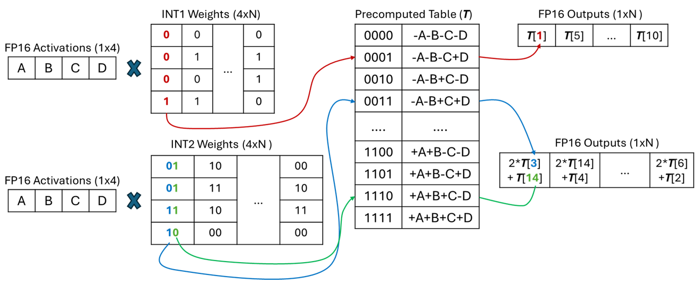

Efficient Mixed-Precision Inference Engine
=========================================

Basic Information
=================

- **Project**: mpGEMM
- **Github**: https://github.com/5000user5000/mpGEMM

On resource-constrained devices, such as embedded systems, running deep learning models, especially LLMs, is highly computationally expensive. Low-bit quantization is a popular solution to reduce memory consumption. However, when weights are quantized below 8 bits, performing matrix multiplication between the weight matrix and an FP16 activation matrix requires dequantization to a common precision, as hardware lacks native support for mixed-precision matrix multiplication (mpGEMM). Some recent research suggests using lookup tables (LUTs) to replace dequantization, further reducing computational overhead.

Problem to Solve
================

- Develop a **low-level numerical computation core** in C++ for high-speed matrix operations.
- Support mixed-precision matrix computation (weight INT1~4) where activation tensors are limited to FP16.
- Implement **precomputed lookup table (LUT)-based computation** to accelerate low-bit matrix multiplications.
- Enable the LUT to reside in the fastest on-chip memory and parallel lookup.

Prospective Users
=================

This inference engine will benefit:

1. **Machine Learning Practitioners**: Researchers and engineers developing efficient LLM inference pipelines.
2. **Embedded AI Developers**: Those optimizing AI models for deployment on edge devices.
3. **Data Scientists**: Users who need optimized inference on diverse hardware setups.
4. **Academia & Research Labs**: Those investigating numerical optimization and quantization techniques.

System Architecture
===================

The proposed mixed-precision inference engine consists of the following components:

**Computational Core (C++ - Low-Level Implementation)**

- Implements **optimized matrix multiplication** (GEMM) using SIMD (AVX, NEON).
- Implements **LUT-based computation** to accelerate quantized matrix multiplications.
- Implements **traditional matrix multiplication** and **benchmark module** to compare latency with the LUT-based one.

**Python API (High-Level Interface)**

- Provides a **user-friendly wrapper** for defining models and executing inference.
- Allows users to specify custom quantization strategies (INT1~4).

API Description
===============

The API will provide the following functionalities:

1. **Custom GEMM Implementation:** Provides high-performance GEMM operations with mixed-precision support.
2. **Lookup Table Operations:** API for LUT-based computation to accelerate quantized matrix multiplications.
3. **Benchmark:** Comparing LUT-based methods against traditional dequantization-based methods in terms of latency.

Engineering Infrastructure
==========================

- **Automated Build System:** Uses CMake to set up the C++ build system and setuptools to build Python packages.
- **Version Control:** Uses Git for version management, with all development processes submitted to the GitHub repository.

Schedule
========

- **Week 1**: Design computational core architecture, set up project repository.
- **Week 2**: Implement matrix multiplication kernels in C++ and write CI to check major functions.
- **Week 3**: Implement lookup table approach.
- **Week 4**: Use SIMD instructions to accelerate lookup table computations.
- **Week 5**: Optimize memory management and implement precision scaling.
- **Week 6**: Integrate the API and complete documentation.
- **Week 7**: Develop a benchmark script to evaluate this project and refine documentation.
- **Week 8**: Final optimizations and documentation.

References
==========

- **DeepGEMM:** https://openaccess.thecvf.com/content/CVPR2023W/ECV/papers/Ganji_DeepGEMM_Accelerated_Ultra_Low-Precision_Inference_on_CPU_Architectures_Using_Lookup_CVPRW_2023_paper.pdf
- **T-MAC:** https://arxiv.org/html/2407.00088v1
